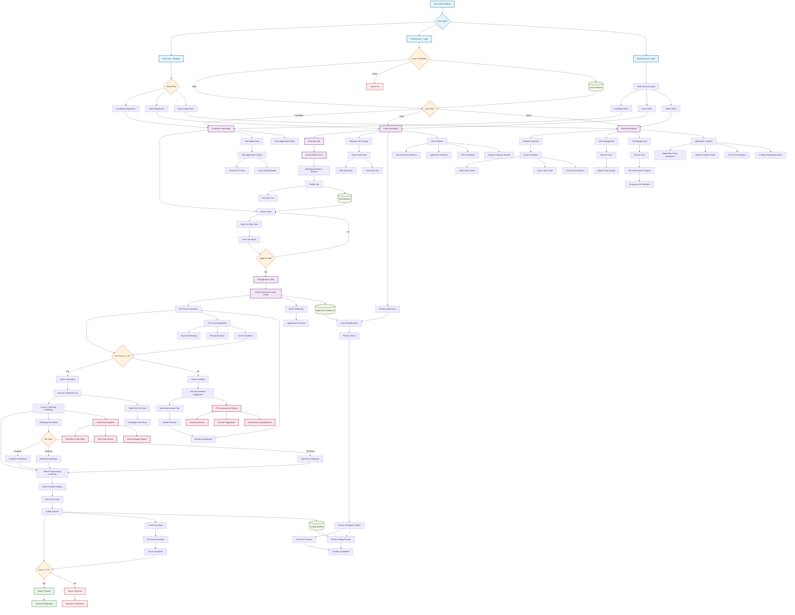

# TalentFlow Platform - Complete System Flow

## Key Features Highlighted in Flow:

### 1. **Multi-Role Authentication System**
- Demo accounts for instant testing
- Role-based dashboard routing
- Secure user management

### 2. **Intelligent ATS Scoring**
- Automated resume analysis
- Keyword matching with job requirements
- Improvement suggestions with specific tips

### 3. **Dynamic Coding Challenges**
- Job-specific challenge generation
- Multi-language support (JavaScript, Python, Java)
- Real-time code execution and testing

### 4. **CoderPad Integration**
- Live coding environment
- Collaborative coding sessions
- Automated test case evaluation

### 5. **Comprehensive Analytics**
- Application tracking for candidates
- Performance metrics for clients
- Platform-wide analytics for admins

### 6. **Smart Notification System**
- Email notifications for key events
- CoderPad link distribution
- Status update communications

### 7. **Data Management**
- Persistent storage for all entities
- Real-time data synchronization
- Cross-role data access patterns

This flow demonstrates how TalentFlow creates a seamless experience where "skills meet stories" through intelligent matching, comprehensive evaluation, and data-driven insights.